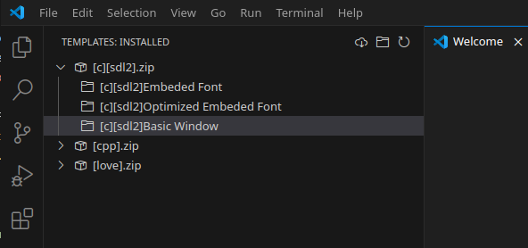

# Template Picker

Create new workspace from selected template.

## Features

- Browse and manage installed project templates from the Templates activity bar.
- Download new templates from a remote repository (GitHub).
- Create a new workspace from a selected template.
- Share or delete installed templates.
- Refresh the list of installed templates.

## Requirements

- Visual Studio Code v1.90.0 or newer.
- Internet connection required to download templates from GitHub.

## Extension Settings

This extension contributes the following settings:

- `template-picker.projectDirectory`: Default directory where new projects will be created. Leave empty to prompt every time.

## Commands

- **Template Picker: Download Template**  
  Download new templates from the remote repository.
- **Template Picker: Refresh Template**  
  Refresh the list of installed templates.
- **Template Picker: Use Template**  
  Create a new project from a selected template.
- **Template Picker: Share Template**  
  Share a template.
- **Template Picker: Delete Template**  
  Delete a template.
- **Template Picker: Create Workspace from Template**  
  Create a new workspace from a template.
- **Template Picker: Show Date**  
  Show the current date.
- **Template Picker: Show Extension Path**  
  Show the extension installation path.

## Known Issues

- Only `.zip` templates are supported.
- Downloaded templates must be compatible with the extension's expected structure.

## Release Notes

### 0.8.0

- Initial release with template management, download, and workspace creation features.

---

**Enjoy using Template Picker!**