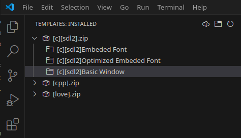

# Template Picker

Create new workspace / project from selected template.  

  
  

## Features
- Browse and manage installed project templates from the Templates activity bar.
- Download new templates from a remote repository (GitHub).
- Create a new workspace from a selected template.
- Share or delete installed templates.
- Refresh the list of installed templates.

## Requirements
- Visual Studio Code v1.90.0 or newer.
- Internet connection required to download templates from GitHub (optional).

## Extension Settings

This extension contributes the following settings:

- `template-picker.projectDirectory`: Default directory where new projects will be created. Leave empty to prompt every time.

## Commands

- **Template Picker: Download Template**  
  Download new templates from the remote repository.
- **Template Picker: Refresh Template**  
  Refresh the list of installed templates.
- **Template Picker: Use Template**  
  Create a new project from a selected template.
- **Template Picker: Share Template**  
  Share a template.
- **Template Picker: Delete Template**  
  Delete a template.
- **Template Picker: Create Workspace from Template**  
  Create a new workspace from a template.
- **Template Picker: Show Date**  
  Show the current date.
- **Template Picker: Show Extension Path**  
  Show the extension installation path.

## Creating Custom Templates
Create workspace then rename the folder name using tags 
```
[language][library1_used][library2_used]This is my template using library1 and library2 

Example:
[cpp][sdl2][imgui]Basic usage of imgui
[love]Template for animation
[go][glfw][opengl] Basic shader
```
Zip the folder and copy the zip to template folder.  
  


## Release Notes

### 1.0.0

- Initial release with template management, download, and workspace creation features.

---

**Enjoy using Template Picker!**